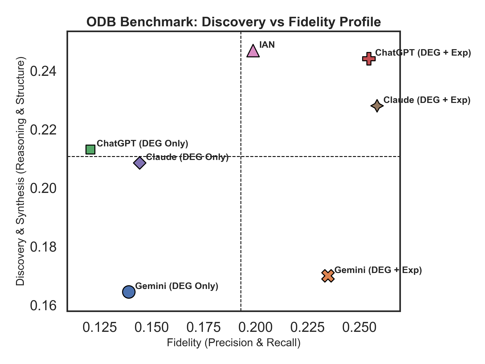

# The Omics Discovery Bench (ODB)
*A Novel Benchmark Framework for Evaluating Higher-Order Reasoning in AI-driven Biological Interpretation*

------------
- **Authors**: Vijay Nagarajan PhD, Reiko Horai PhD
- **Affiliation**: Laboratory of Immunology, NEI/NIH
- **Contact**: nagarajanv@nih.gov
------------

## Introduction: A Benchmark for scientific reasoning

In complex scientific fields like bioinformatics, the true value of an AI tool is not just its accuracy, but its ability to perform higher-order reasoning—synthesizing data into coherent narratives, forming novel hypotheses, and constructing plausible models of biological systems. Standard Natural Language Processing benchmarks often fail to capture this crucial dimension.

The **Omics Discovery Bench (ODB)** was developed to address this gap. ODB is an open-source benchmark framework that evaluates and ranks analytical tools on their ability to interpret high-throughput omics data. Our "Groundedness-First" philosophy prioritizes structured, verifiable, and data-driven reasoning over simple narrative fluency.

---

## 🏆 Official Leaderboard

We benchmarked 7 different analytical approaches, including general-purpose LLMs and our novel **I**ntelligent System for Omics Data **An**lysis and Discovery (IAN).

**The final ranking, based on our "Grounded Reasoning Score," demonstrates a clear performance hierarchy, with the specialized IAN framework showing a distinct advantage in structured biological interpretation.**

<div align="center">

| Rank | Tool | Final Grounded Score |
| :---: | :--- | :---: |
| **🥇 1** | IAN | **0.1689** |
| **🥈 2** | Claude (DEG + Exp) | 0.1592 |
| **🥉 3** | ChatGPT (DEG + Exp) | 0.1581 |
| **4** | Claude (DEG Only) | 0.1297 |
| **5** | Gemini (DEG + Exp) | 0.1240 |
| **6** | ChatGPT (DEG Only) | 0.1230 |
| **7** | Gemini (DEG Only) | 0.1109 |

</div>

*   DEG - Differentially Expressed Genes
*   Exp - Experimental Design
*   IAN - The IAN benchmarked here used Gemini as the LLM, along with DEG, Exp and a novel data augmentation framework.

While the ranked table provides the final verdict, the performance profile of each tool reveals a more nuanced story. The quadrant plot below visualizes the trade-off between pure factual recall ("Fidelity Score") and higher-order reasoning ("Discovery & Synthesis Score").

<div align="center">
  
</div>

*__Figure 1:__ Performance profile of all benchmarked tools, averaged across 8 datasets. The plot highlights the unique analytical profile of the IAN framework, which excels in Discovery & Synthesis.*

---

## Ground Truth Datasets

The benchmark is built upon 8 diverse, publicly available human omics datasets. The ground truth for each was manually curated from the corresponding peer-reviewed publication. Full details can be found in the linked manuscripts and the JSON files within the `groundtruth_data/` directory.

<div align="center">

| ID | Phenotype | Tissue | Hub Genes | DEGs | Original Tools | Source (PMID) |
|:---|:---|:---|:---:|:---:|:---|:---|
| **BC** | Breast Cancer | Breast Tissue | 15 | 254 | clusterProfiler, Cytoscape | [31423162](https://pubmed.ncbi.nlm.nih.gov/31423162/) |
| **HCM**| Hypertrophic Cardiomyopathy| Heart Tissue | 8 | 48 | Python, STRING, Cytoscape | [34225646](https://pubmed.ncbi.nlm.nih.gov/34225646/) |
| **PD1**| Early Rheumatoid Arthritis| CD4⁺ T Cells | 19 | 347 | IPA, GSVA | [36801909](https://pubmed.ncbi.nlm.nih.gov/36801909/) |
| **BP** | Bullous Pemphigoid | PBMCs | 11 | 267 | DAVID, Reactome | [40736520](https://pubmed.ncbi.nlm.nih.gov/40736520/) |
| **MN** | Membranous Nephropathy | Glomeruli | 14 | 501 | STRING, Metascape, GSVA | [37876929](https://pubmed.ncbi.nlm.nih.gov/37876929/) |
| **GC** | Gastric Cancer | Gastric Tissue | 10 | 203 | clusterProfiler, STRING | [38041130](https://pubmed.ncbi.nlm.nih.gov/38041130/) |
| **UV** | Uveitis | Whole Blood | 12 | 180 | edgeR (goana, kegga) | [33503442](https://pubmed.ncbi.nlm.nih.gov/33503442/) |
| **PAD**| Peripheral Arterial Disease| PBMCs | 16 | 85 | DAVID, IPA | [22409835](https://pubmed.ncbi.nlm.nih.gov/22409835/) |

</div>

---

## Benchmark Methodology

The Omics Discovery Benchmark (ODB) evaluates the analytical and interpretative capabilities of AI tools by scoring their outputs against a curated ground truth. The methodology is executed through a series of sequential scripts, ensuring a reproducible and transparent workflow.

### **Step 1: Data Setup and Standardization**

1.  **Ground Truth Generation (`1_odb_setup.py`):** The benchmark foundation is created using curated data from 8 peer-reviewed publications. This script generates a `ground_truth.json` file for each dataset, containing the expert-validated answers for all 12 benchmark tasks.
2.  **Tool Output Standardization (`2_odb_create_json.py`):** Raw outputs from each evaluated tool are parsed and consolidated into a single, standardized `odb_tool_output.json` file for each dataset, mirroring the structure of the ground truth file.
3.  **Input Validation (`3_odb_validate_io.py`):** Before scoring, this script automatically verifies that for every dataset, both the `ground_truth.json` and the tool's `odb_tool_output.json` exist, are valid, and contain all 12 mandatory data keys.

### **Step 2: Task-by-Task Performance Scoring**

The core evaluation is performed by the main benchmark script (`4_odb_run_benchmark.py`), which systematically compares the tool's output against the ground truth for each of the 12 tasks defined below.

---

#### **Detailed Task Descriptions**

**Task 1: Hub Gene Identification**
*   **Objective:** To evaluate the tool's ability to identify and rank the most impactful "hub genes" as determined by the original study authors.
*   **Importance:** Correctly identifying central genes in a network is critical for prioritizing targets for functional validation and therapeutic development.
*   **Methodology:** The tool's ranked list of genes is compared against the ground truth list using **Normalized Discounted Cumulative Gain (NDCG)**. This metric rewards both the presence of correct genes and their high placement in the ranked list.

**Task 2: Enrichment Analysis Fidelity**
*   **Objective:** To assess how accurately the tool's identified biological pathways match the key pathways discussed in the source publication.
*   **Importance:** Pathway analysis provides biological context to a gene list. High fidelity ensures the tool's interpretations align with established biological narratives.
*   **Methodology:** The set of pathway terms from the tool and the ground truth are compared using the **Jaccard Index** for lexical overlap and **Cosine Similarity** for semantic overlap.

**Task 3: Enrichment Categorization**
*   **Objective:** To measure the tool's ability to group disparate enrichment terms into higher-level, coherent biological themes (e.g., grouping "mitosis" and "DNA replication" into "Cell Cycle").
*   **Importance:** This tests a tool's reasoning and abstraction capabilities, which are essential for simplifying complex data into an understandable story.
*   **Methodology:** This is a set-of-sets comparison. For each ground truth category, we find the best-matching tool-generated category based on the **Jaccard Index** of their member genes. The final score is the average of these best-match scores.

**Task 4: Regulatory Network Edge Discovery**
*   **Objective:** To score the tool's accuracy in identifying specific, directed regulatory relationships (e.g., Transcription Factor → Target Gene) mentioned in the literature.
*   **Importance:** Discovering regulatory mechanisms is fundamental to understanding gene expression control and identifying points for therapeutic intervention.
*   **Methodology:** The ranked list of edges from the tool is evaluated against the ground truth set using **Mean Reciprocal Rank (MRR)**. This metric heavily rewards the tool for identifying correct edges early in its ranked output.

**Task 5: Biological Process Synthesis**
*   **Objective:** To evaluate the quality and accuracy of the tool's overall narrative summary of the biological story presented in the paper.
*   **Importance:** A key value of AI tools is their ability to synthesize vast amounts of data into a concise, human-readable abstract. This task measures the quality of that synthesis.
*   **Methodology:** The tool's summary text is compared to the ground truth abstract using **Cosine Similarity** on sentence-transformer model embeddings (`all-MiniLM-L6-v2`).

**Task 6: Hypothesis Generation**
*   **Objective:** To assess the tool's ability to generate relevant, forward-looking, and testable hypotheses that are consistent with the original study's conclusions.
*   **Importance:** Science progresses through hypothesis generation. This measures the tool's capacity to function as a creative scientific partner.
*   **Methodology:** The semantic alignment between the tool's generated hypotheses and the ground truth statements is measured via **Cosine Similarity**.

**Task 7: Novel Insight Identification**
*   **Objective:** To measure the tool's ability to identify and articulate the specific claims of novelty made by the original authors.
*   **Importance:** Recognizing what is truly "new" in a study is a sophisticated form of scientific reasoning and is crucial for understanding a discovery's impact.
*   **Methodology:** The tool's stated novel insights are compared to the ground truth statements using **Cosine Similarity**.

**Task 8: Analogous System Discovery**
*   **Objective:** To evaluate the tool's ability to identify other diseases, phenotypes, or biological systems that are relevant to or comparable with the study's findings.
*   **Importance:** Placing findings in a broader context (e.g., comparing mechanisms in rheumatoid arthritis to those in lupus) is a hallmark of deep biological understanding.
*   **Methodology:** The tool's list of analogous systems is compared to the ground truth list using the **Jaccard Index**.

**Task 9: Publication Title Generation**
*   **Objective:** To assess the tool's ability to generate a concise, accurate, and descriptive title that captures the essence of the study.
*   **Importance:** This is a test of high-level summarization and the ability to pinpoint the single most important message of a study.
*   **Methodology:** The tool-generated title is compared to the actual publication title using **Cosine Similarity**.

**Task 10: System Model Reconstruction**
*   **Objective:** To score the tool's ability to reconstruct the author's conceptual model of the system by correctly grouping genes into functional modules.
*   **Importance:** This tests the tool's ability to infer structured relationships and build a coherent system model from a simple list of genes.
*   **Methodology:** Similar to Task 3, this is a set-of-sets problem. The final score is the mean **Jaccard Index** of the best-matching gene modules between the tool and the ground truth.

**Task 11: Hub Gene Annotation**
*   **Objective:** To evaluate the tool's accuracy in annotating key genes with functional categories (e.g., Drug Target, Kinase, Biomarker) based on external knowledge.
*   **Importance:** This is a direct measure of the tool's ability to integrate external database knowledge, which is critical for translating -omics data into actionable insights.
*   **Methodology:** For each category, the tool's gene list is treated as a classification result. The **F1-Score** (the harmonic mean of precision and recall) is calculated, and the final score is the average F1 across all categories.

**Task 12: Component-Level Summarization**
*   **Objective:** To assess the tool's ability to provide accurate, concise summaries for individual components of its own analysis (e.g., "What did the GO analysis show?").
*   **Importance:** This measures the tool's self-awareness and its ability to explain its own reasoning and results, which is vital for user trust and interpretability.
*   **Methodology:** For each component (e.g., KEGG, GO), the tool's summary is compared to a curated ground truth summary using **Cosine Similarity**. The final score is the average across all matched components.

---

### **Step 3: Aggregate Analysis and Final Ranking**

1.  **Aggregate Statistics (`5_odb_analysis_script.py`):** The detailed, per-dataset scores are aggregated to calculate the mean and standard deviation for each metric, summarizing each tool's average performance.
2.  **Final Weighted Ranking (`7_odb-final-score.py`):** A composite **"Grounded Reasoning Score"** is calculated for each tool. This score is a weighted average of the primary metrics from the 12 tasks, with weights specifically chosen to prioritize performance on structured, verifiable tasks over more subjective ones. The tools are then ranked in descending order based on this final score to produce the definitive ODB benchmark ranking.

---

## How to Contribute Your Tool

We welcome and encourage submissions from the community. If you have a tool you would like to benchmark against ODB, please follow these steps:

1.  **Generate Outputs:** For each of the 8 datasets, run your tool using the provided input data (DEG lists and experimental design text).
2.  **Format Your Results:** Your tool must produce one `odb_tool_output.json` file for each of the 8 datasets. The JSON file must strictly adhere to the structure and field names of the standardized output format.
3.  **Consult the Template:** For a definitive example of the required JSON structure, please see the output file for the Breast Cancer (BC) dataset here: **[odb_tool_output.json template](https://github.com/NIH-NEI/odb/blob/main/results/tools_outputs/chatgpt_gex_exp/BC/odb_tool_output.json)**.
4.  **Organize and Submit:** Please organize your 8 output files into a directory structure named after your tool, as shown below, and contact us via email to coordinate the transfer. We will run the performance evaluation and add your tool to the official leaderboard.

    ```
    your_tool_name/
    ├── BC/
    │   └── odb_tool_output.json
    ├── BP/
    │   └── odb_tool_output.json
    ├── GC/
    │   └── odb_tool_output.json
    ├── HCM/
    │   └── odb_tool_output.json
    ├── MN/
    │   └── odb_tool_output.json
    ├── PAD/
    │   └── odb_tool_output.json
    ├── PD1/
    │   └── odb_tool_output.json
    └── UV/
        └── odb_tool_output.json
    ```

---

## Project Structure

To ensure clarity and reproducibility, the ODB project is organized into the following directories:

<div align="center">

| Folder | Description |
| :--- | :--- |
| [`groundtruth_data/`](https://github.com/NIH-NEI/odb/tree/main/groundtruth_data) | Contains the curated ground truth data for the 8 diverse omics datasets in the benchmark. |
| [`results/tools_outputs/`](https://github.com/NIH-NEI/odb/tree/main/results/tools_outputs) | Contains the raw JSON outputs from each benchmarked tool, organized by tool name and dataset ID. |
| [`analysis_scripts/`](https://github.com/NIH-NEI/odb/tree/main/analysis_scripts) | Provides the Python scripts used to process the raw JSON outputs and calculate the final scores. |
| [`results/`](https://github.com/NIH-NEI/odb/tree/main/results) | Contains generated figures and IAN's original analysis results for all 8 datasets. |
| [`performance_scores/`](https://github.com/NIH-NEI/odb/tree/main/performance_scores) | Contains generated scores for all tools evaluated. |

</div>

---

## Conclusion

The Omics Discovery Bench successfully distinguishes between different classes of AI-driven analysis. While context-aware generalist LLMs are powerful, they function primarily as high-fidelity information recall engines. The IAN framework, by contrast, demonstrates a superior capacity for grounded, structural reasoning. Its top-ranking performance on our "Grounded Reasoning Score" and its unique position in the performance quadrant confirm that its structured, multi-agent methodology represents a more rigorous and scientifically valuable approach for genuine biological discovery.

---

<p align="center">
  The Omics Discovery Bench (ODB) Project | 2026
  <br>
  (P.S. Gemini was my research and coding assistant for this project!)
</p>
