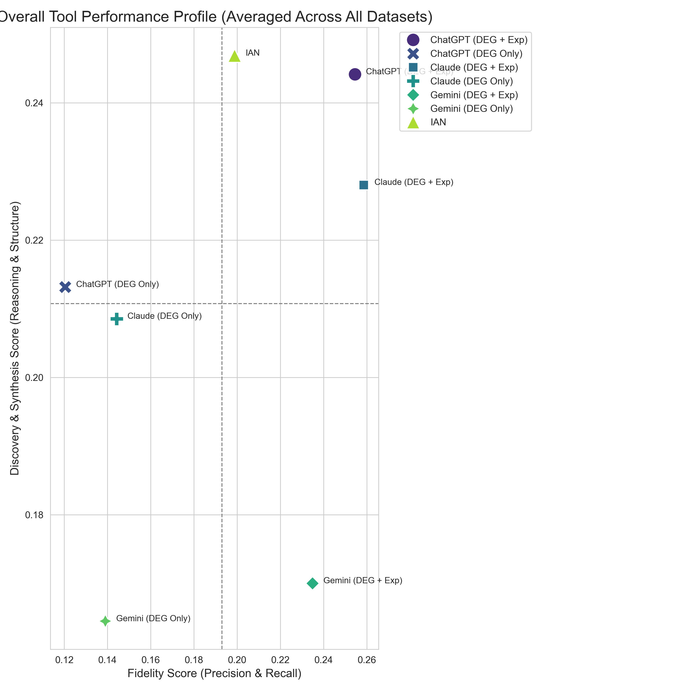

# The Omics Discovery Bench (ODB)
*A Novel Benchmark Framework for Evaluating Higher-Order Reasoning in AI-driven Biological Interpretation*

------------
- **Authors**: Vijay Nagarajan PhD, Reiko Horai PhD
- **Affiliation**: Laboratory of Immunology, NEI/NIH
- **Contact**: nagarajanv@nih.gov
------------

## Introduction: A Benchmark for Scientific Reasoning

In complex scientific fields like bioinformatics, the true value of an AI tool is not just its accuracy, but its ability to perform higher-order reasoning—synthesizing data into coherent narratives, forming novel hypotheses, and constructing plausible models of biological systems. Standard NLP benchmarks often fail to capture this crucial dimension.

The **Omics Discovery Bench (ODB)** was developed to address this gap. ODB is an open-source benchmark framework that evaluates and ranks analytical tools on their ability to interpret high-throughput omics data. Our "Groundedness-First" philosophy prioritizes structured, verifiable, and data-driven reasoning over simple narrative fluency.

---

## Project Structure

To ensure clarity and reproducibility, the ODB project is organized into the following directories:

| Folder | Description |
| :--- | :--- |
| `groundtruth_data/` | Contains the curated ground truth data for the 8 diverse omics datasets used in the benchmark. This is the baseline against which all tools are evaluated. |
| `results/tools_outputs/` | Contains the raw JSON outputs from each benchmarked tool, organized by tool name and dataset ID. |
| `analysis_scripts/` | Provides the Python scripts used to process the raw JSON outputs and calculate the final "Grounded Reasoning Score." |
| `results/figures/` | Contains generated figures and IAN's original analysis results for all the 8 datasets. |

---

## Ground Truth Datasets

The benchmark is built upon 8 diverse, publicly available omics datasets. The ground truth for each dataset was manually curated from the corresponding peer-reviewed publication.

| ID | Species | PMID | Phenotype | Hub Genes | DEGs | DEGs (Clean) | Methods | Tools | Experimental Design |
| :--- | :--- | :--- | :--- | :--- | :--- | :--- | :--- | :--- | :--- |
| **BC** | Human | [31423162](https://pubmed.ncbi.nlm.nih.gov/31423162/) | Breast Cancer | 15 | 322 | 254 | KEGG, GO, STRING, WGCNA | clusterProfiler, MCODE, Cytoscape | Differentially expressed genes from breast cancer patients vs. normal controls. |
| **HCM**| Human | [34225646](https://pubmed.ncbi.nlm.nih.gov/34225646/) | Hypertrophic Cardiomyopathy | 8 | 48 | 48 | Integrated DEG calling, mRMR, SVM/RF/KNN classification | Python, STRINGDB, BioGRID, Cytoscape | Differentially expressed genes from heart tissues of HCM cases vs. healthy controls. |
| **PD1**| Human | [36801909](https://pubmed.ncbi.nlm.nih.gov/36801909/) | Early Rheumatoid Arthritis | 19 | 347 | 347 | Pathway analysis, Regulator analysis, GSVA | IPA, GSVA | DEGs from sorted CD4⁺ PD-1⁺ T cells vs. CD4⁺ PD-1⁻ T cells from early RA patients. |
| **BP** | Human | [34953935](https://pubmed.ncbi.nlm.nih.gov/34953935/) | Bullous Pemphigoid | 11 | 267 | 267 | GO enrichment, Pathway analysis | DAVID, Reactome pathways | DEGs from total PBMCs of new bullous pemphigoid patients vs. healthy controls. |
| **MN** | Human | [37876929](https://pubmed.ncbi.nlm.nih.gov/37876929/) | Membranous Nephropathy | 14 | 501 | 501 | KEGG, GO, STRING, WGCNA, GSEA | STRING, CytoHubba, Metascape, GSVA | DEGs from membranous nephropathy patients vs. healthy controls using public data. |
| **GC** | Human | [38041130](https://pubmed.ncbi.nlm.nih.gov/38041130/) | Gastric Cancer | 10 | 203 | 203 | KEGG, GO, STRING, PPI network analysis | clusterProfiler, STRING, Cytoscape, GEPIA2 | DEGs from gastric cancer tissues vs. normal gastric tissues using public data. |
| **UV** | Human | [33503442](https://pubmed.ncbi.nlm.nih.gov/33503442/) | Uveitis | 12 | 180 | 180 | KEGG, GO enrichment | `goana` and `kegga` in edgeR | DEGs from whole-blood RNA-Seq of 90 uveitis patients vs. 18 healthy controls. |
| **PAD**| Human | [22409835](https://pubmed.ncbi.nlm.nih.gov/22409835/) | Peripheral Arterial Disease | 16 | 87 | 85 | KEGG, Reactome, GO, Network analysis | DAVID, Ingenuity Pathway Analysis | DEGs from PBMCs in patients with Peripheral Arterial Disease vs. controls. |

---

## How The Benchmark Works

The ODB methodology evaluates tools against the curated ground truth. The final ranking is produced through a multi-step process designed to reward scientific rigor.

1.  **12 Standardized Tasks:** Each tool is assessed on a suite of tasks, ranging from high-fidelity data extraction (e.g., `Hub Gene Identification`) to high-level abstractive reasoning (e.g., `System Model Reconstruction`).
2.  **Quantitative Scoring:** Over 15 distinct metrics are calculated, including NDCG for ranking, Jaccard Similarity for set fidelity, and Cosine Similarity for semantic textual alignment.
3.  **"Groundedness-Weighted" Composite Score:** To generate a final ranking, we developed the "Grounded Reasoning Score." This composite score assigns higher weights to tasks that require structured, verifiable reasoning and are resistant to ungrounded hallucination (e.g., `System Model`, `Hub Gene Annotation`). Free-form narrative tasks, where fluent but ungrounded answers can score deceptively high, are weighted lower.

---

## Benchmark Results

We benchmarked 7 different analytical approaches, including our novel **I**ntelligent System for Omics Data **An**lysis and Discovery (IAN) and several general-purpose LLMs (Gemini, ChatGPT, Claude) with and without experimental context. The final ranking, based on our "Grounded Reasoning Score," demonstrates a clear performance hierarchy.

**Table 2:** Final tool ranking based on the "Grounded Reasoning Score."

| Rank | Tool | Final Grounded Score |
| :--- | :--- | :--- |
| **1** | IAN | 0.1689 |
| **2** | Claude (DEG + Exp) | 0.1592 |
| **3** | ChatGPT (DEG + Exp) | 0.1581 |
| **4** | Claude (DEG Only) | 0.1297 |
| **5** | Gemini (DEG + Exp) | 0.1240 |
| **6** | ChatGPT (DEG Only) | 0.1230 |
| **7** | Gemini (DEG Only) | 0.1109 |

While the ranked table provides the final verdict, the performance profile of each tool reveals a more nuanced story. The quadrant plot below visualizes the trade-off between pure factual recall ("Fidelity Score") and higher-order reasoning ("Discovery & Synthesis Score").



*__Figure 1:__ Performance profile of all benchmarked tools, averaged across 8 datasets. The plot highlights the unique analytical profile of the IAN framework.*

---

## Conclusion

The Omics Discovery Bench successfully distinguishes between different classes of AI-driven analysis. While context-aware generalist LLMs are powerful, they function primarily as high-fidelity information recall engines. The IAN framework, by contrast, demonstrates a superior capacity for grounded, structural reasoning. Its top-ranking performance on our "Grounded Reasoning Score" and its unique position in the performance quadrant confirm that its structured, multi-agent methodology represents a more rigorous and scientifically valuable approach for genuine biological discovery.

---

## How to Contribute Your Tool

We welcome and encourage submissions from the community. If you have a tool you would like to benchmark against ODB, please follow these steps:

1.  **Generate Outputs:** For each of the 8 datasets, run your tool using the provided input data (DEG lists and experimental design text).
2.  **Format Your Results:** Your tool must produce one `odb_tool_output.json` file for each of the 8 datasets. The JSON file must strictly adhere to the structure and field names of the standardized output format.
3.  **Consult the Template:** For a definitive example of the required JSON structure, please see the output file for the Breast Cancer (BC) dataset here: **[odb_tool_output.json template](https://github.com/NIH-NEI/odb/blob/main/results/tools_outputs/chatgpt_gex_exp/BC/odb_tool_output.json)**.
4.  **Organize and Submit:** Please organize your 8 output files into a directory structure named after your tool, as shown below, and contact us via email to coordinate the transfer. We will run the performance evaluation and add your tool to the official leaderboard.

    ```
    your_tool_name/
    ├── BC/
    │   └── odb_tool_output.json
    ├── BP/
    │   └── odb_tool_output.json
    ├── GC/
    │   └── odb_tool_output.json
    ├── HCM/
    │   └── odb_tool_output.json
    ├── MN/
    │   └── odb_tool_output.json
    ├── PAD/
    │   └── odb_tool_output.json
    ├── PD1/
    │   └── odb_tool_output.json
    └── UV/
        └── odb_tool_output.json
    ```

---

<p align="center">
  The Omics Discovery Bench (ODB) Project | 2026
  <br>
  (P.S. Gemini was my research and coding assistant for this project!)
</p>
